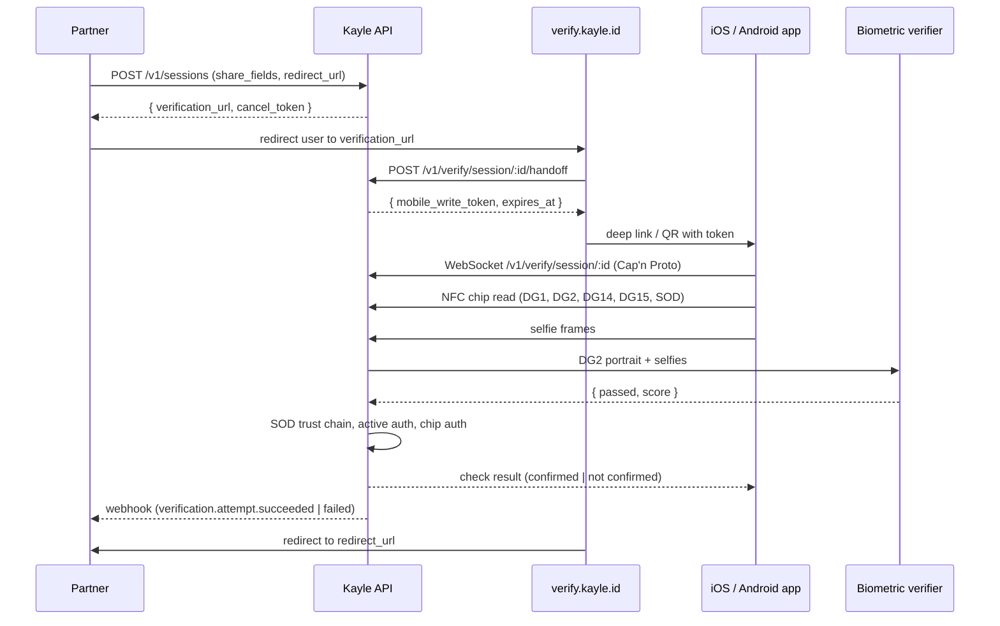

Kayle ID produces an identity-assurance signal by reading the cryptographic chip embedded in an ID document, checking the document's signatures against the issuing country's public key infrastructure, and matching the on-chip portrait against a live selfie. The underlying biometric and chip data never leaves the verification pipeline, and the relying party remains responsible for any access, onboarding, or eligibility decision it makes from the result.

## Components

A complete Kayle ID deployment is a small set of services that talk to each other and to the user's phone:

| Component | Role |
|---|---|
| `apps/api` | The Cloudflare Worker that exposes the public API and orchestrates verifications. |
| `apps/verify` | The web app users land on (`verify.kayle.id`). Renders consent and produces a handoff payload for the mobile app. |
| `apps/ios`, `apps/android` | Native apps that read the document chip over NFC and capture the selfie. |
| `infra/biometric-verifier` | A separate Worker plus container that compares the on-chip portrait (DG2) to the user's selfies. |
| `database/trust-store` | A Cloudflare D1 database seeded from the [ICAO PKD](https://pkddownload.icao.int/downloads). Holds CSCA certificates and CRLs used to verify document signatures. |
| `database/kayle-id` | Postgres. Stores sessions, attempts, events, webhook deliveries — metadata only, never document data. |

The hosted product runs all of these on Cloudflare. Self-hosters deploy the same components on their own Cloudflare account.

## A typical verification

The API is the only component you talk to directly. Everything past `verification_url` is the user's experience, driven by the verify app and the mobile app.

## The trust model

Three independent checks run before Kayle can confirm a check:

1. **Passive authentication** — The Security Object (SOD) on the chip is a CMS-signed manifest of every data group. Kayle verifies the SOD signature against the Document Signer Certificate (DSC), then walks the chain to a Country Signing CA (CSCA) trusted by the [ICAO PKD](https://pkddownload.icao.int). Each data group's hash must match the SOD declaration. Recent Certificate Revocation Lists are consulted; missing or stale CRL coverage is reported as `revocation_unknown` and tightens the policy decision.
2. **Active authentication** — If the document carries a DG15, the chip signs a freshly derived challenge with its private key. A successful signature confirms the chip you're talking to is the same chip that was personalised at issuance, not a clone holding the same data.
3. **Chip authentication** — If the document carries a DG14 (most modern passports), the chip and the reader run an authenticated key agreement. The transcript binds the rest of the session to the genuine chip and frustrates man-in-the-middle attempts.

The selfie is matched against the on-chip portrait by the biometric verifier service. The check is fail-closed: if the verifier is unavailable, Kayle returns a not-confirmed result. In production a fallback biometric path is treated as not confirmed even if the score is high.

See [Document checks](/verifications/document-checks) for the full check list and the failure codes that map to each step.

## The verification protocol

Mobile clients drive the Kayle check over a single WebSocket. The wire format is [Cap'n Proto](https://capnproto.org), defined in `packages/capnp/verify.capnp`. The protocol has a small message vocabulary: a hello, a handful of phase updates, chunked binary data payloads (DG1, DG2, DG14, DG15, SOD, selfie frames, active-auth signatures), and a check result.

You don't implement this yourself. The mobile apps implement it; the verify web app coordinates the handoff.

## Data the API stores

The Postgres database holds:

- **Verification sessions** — status, expiry, requested share fields, optional `redirect_url`, hashed `cancel_token`.
- **Verification attempts** — status, failure code if any, risk score, hashed mobile write token, hashed device ID, app version, current phase.
- **Events** — domain events (`verification.attempt.succeeded`, etc.) with a trigger ID, but no PII.
- **Webhook deliveries** — endpoint ID, status, attempt count, payload (encrypted in transit when an encryption key is registered).

It does **not** store DG1, DG2, DG14, DG15, SOD bytes, selfies, or any plaintext claims. Those are processed in memory while the WebSocket is open and discarded when it closes. See [Privacy](/verifications/privacy) for the full list.

## What happens after a verification

When the API marks an attempt terminal it emits a domain event. The webhook subsystem looks up subscribed endpoints, builds a delivery row per endpoint, signs the payload with the endpoint's signing secret, encrypts it as a JWE using your registered encryption key, and POSTs it. Failed deliveries retry up to three times with exponential backoff. See [Webhook deliveries](/webhooks/deliveries) for the precise schedule.
